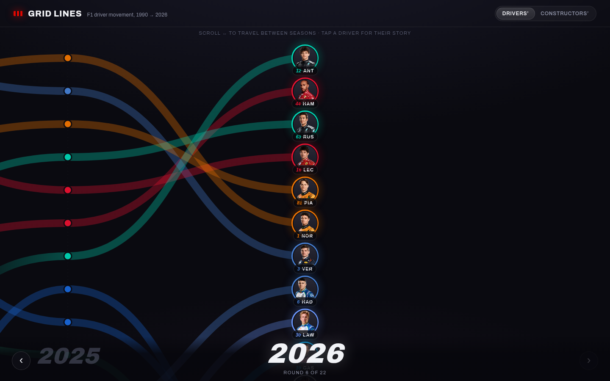

# Grid Lines — F1 Driver Movement

An interactive visualization of Formula 1 drivers and how they moved between
teams, season by season. Built as a fully static site powered by a
pre-generated dataset from the [OpenF1 API](https://openf1.org).



## How it works

- **Timeline** — seasons are laid out left-to-right; scroll (or use the
  on-screen arrows / keyboard arrows) to travel between years. Scrolling snaps
  to the year centered on screen.
- **Travel lines** — each driver is a thick translucent line in their team's
  colour, moving between their championship positions year over year. Colour
  gradients between seasons show team switches; lines that fall away and fade
  mark debuts, returns and exits.
- **Pucks** — the centered year shows each driver as a circular portrait with
  a team-coloured ring (split into multiple colours when a driver changed
  teams mid-season), plus their race number and three-letter abbreviation.
- **Hover** a line or puck to highlight that driver's whole journey and see
  their points for that year. **Click** to open a detail flyout with
  milestones (first/latest race, win, pole) and a season-by-season breakdown.
- **Sorting** — toggle between drivers'-championship order and
  constructors'-championship order (teammates grouped, teams ranked).

## Data

The dataset covers **1990 to the present**, stitched together from:

- **1990–2022** — [Jolpica F1](https://api.jolpi.ca) (community successor to
  Ergast): results, grids, and *official* standings, which bakes in
  era-specific scoring rules like 1990's dropped scores.
- **2023–present** — [OpenF1](https://openf1.org): results plus official team
  colours and driver headshots.
- Historical driver portraits come from Wikipedia page thumbnails; historical
  team colours are a hand-curated map in `scripts/fetch-data.mjs`
  (`CONSTRUCTOR_COLOURS`) — tweak to taste.

Regenerate with:

```sh
npm run fetch-data
```

Raw API responses are cached in `data/cache/` (completed seasons never
change), so re-running after a race weekend only fetches what's new. OpenF1's
free tier allows ~30 requests/minute and Jolpica ~500/hour; the first full
fetch takes a while, incremental updates do not.

Output lands in `public/data/f1.json` and `public/portraits/`.

## Develop / build

```sh
npm install
npm run dev       # local dev server
npm run build     # static site in dist/
npm run preview   # serve the built site
```

The build is fully static — host `dist/` anywhere.

## Stack

Vite · vanilla JS · D3 (scales/joins) · GSAP (animation) · OpenF1 API
